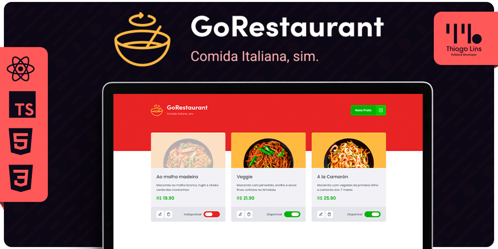

<div align="center" id='top'>
  
[🇧🇷 Português](./README.md) | [🇺🇸 English](./README_EN.md) | [🇪🇸 Español](./README_ES.md)

</div>

# GORestaurant

<div align="center">



[Ver Demonstração](https://td-go-restaurant.vercel.app/)

[](https://github.com/thiilins/GORestaurant)
[](https://github.com/thiilins/GORestaurant)
[](https://github.com/thiilins/GORestaurant)
[](https://github.com/thiilins/GORestaurant)

</div>

## 📖 Índice

- [Sobre o Projeto](#-sobre-o-projeto)
- [Capturas de Tela](#-capturas-de-tela)
- [Instalação e Uso](#-instalação-e-uso)
- [Tecnologias](#-tecnologias)
- [Licença](#-licença)
- [Como Contribuir](#-como-contribuir)
- [Agradecimentos](#-agradecimentos)
- [Contato](#-contato)

## 📘 Sobre o Projeto

Desafio 2 do módulo 2 da trilha de ReactJS da Rocketseat, essa será uma aplicação já funcional onde o seu principal objetivo é realizar dois processos de migração: de Javascript para Typescript e de Class Components para Function Components.,

## 📷 Capturas de Tela

#### Em Construção 🔨🚧

## 🚀 Instalação e Uso

```bash
# Clone este repositório:
git clone https://github.com/thiilins/GORestaurant.git

# Acesse o diretório do projeto:
cd GORestaurant

# Instale as dependências:
yarn
# ou
npm install

# Inicie a aplicação:
yarn start

# Acesse a aplicação em seu navegador em: `http://localhost:3000`
```

## 🛠 Tecnologias

- [Expo](https://expo.io/)
- [Node.js](https://nodejs.org/en/)
- [React](https://pt-br.reactjs.org/)
- [TypeScript](https://www.typescriptlang.org/)

## 📜 Licença

Este projeto está sob a licença MIT. Consulte o arquivo [LICENSE](./LICENSE) para obter mais detalhes.

## 🤝 Como Contribuir

1. **Fork** este repositório.
2. Crie uma nova **branch** com suas modificações: `git checkout -b minha-feature`.
3. Salve suas alterações e faça um commit explicando o que você fez: `git commit -m "Adicionando minha-feature"`.
4. Envie suas alterações: `git push origin minha-feature`.
5. Crie uma **pull request**.

## 🙌 Agradecimentos

Agradecemos a todos os contribuidores que tornaram este projeto possível.

## 📬 Contato

Para sugestões, feedback ou dúvidas, abra uma [issue](https://github.com/seu-usuario/seu-projeto/issues) ou entre em contato através do meu [perfil no GitHub](https://github.com/seu-usuario).
<p align="right">(<a href="#top">Voltar para o topo</a>)</p>

